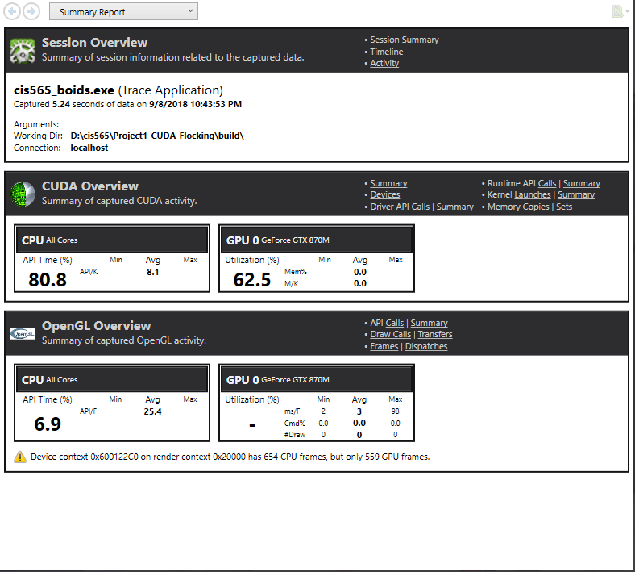
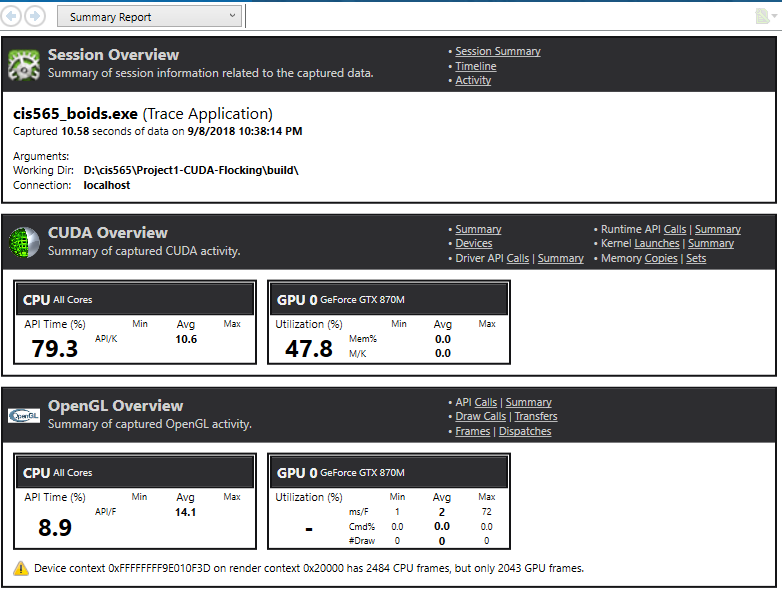
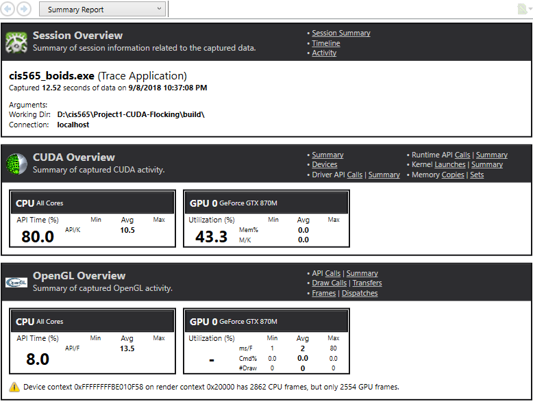
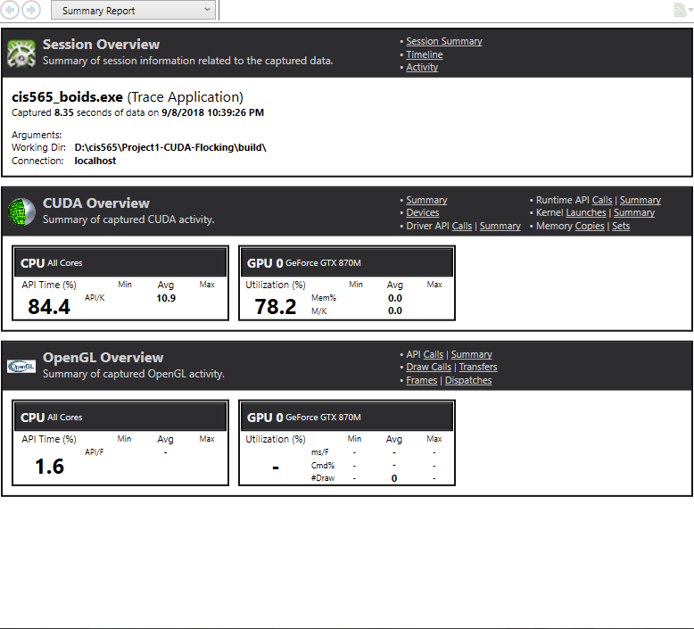
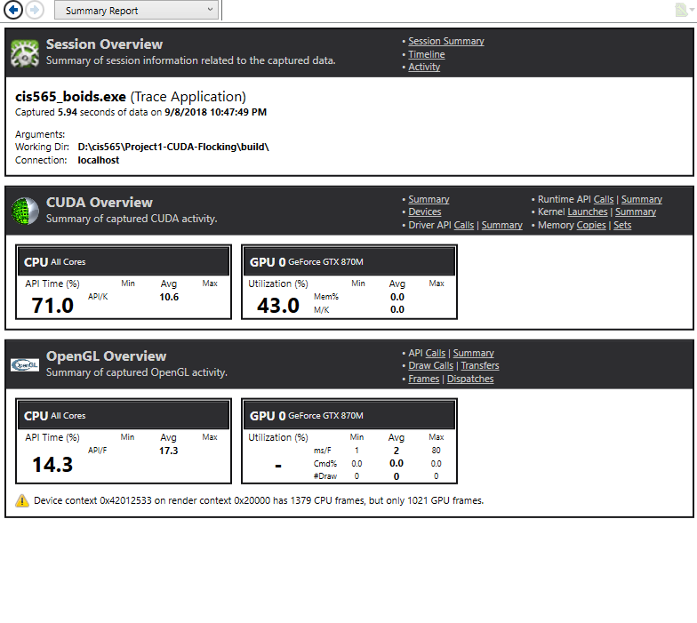

**University of Pennsylvania, CIS 565: GPU Programming and Architecture,
Project 1 - Flocking**

## 1000 boids and 10000 boids with coherence

* Henry Zhu
  * [LinkedIn](https://www.linkedin.com/in/henry-zhu-347233121/), [personal website](https://maknee.github.io/), [twitter](https://twitter.com/maknees1), etc.
* Tested on: Windows 10 Home, Intel i7-4710HQ @ 2.50GHz 22GB, GTX 870M (Own computer)

## Answer to Questions

### For each implementation, how does changing the number of boids affect performance? Why do you think this is?

If one has more boids, the CUDA has to calculate iterate through more boids and calulate neighboring nodes. This impacts performance, especially for the naive implementation, which iterates through all boids for each boid when checking for the rule. For the non-naive implemenation, this is less impactful since boids are stored in grid cells.

### For each implementation, how does changing the block count and block size affect performance? Why do you think this is?

When changing the block count/block size to be more, this impacts performance by splitting up more work to the GPUs, so more kernel threads can run. 

### For the coherent uniform grid: did you experience any performance improvements with the more coherent uniform grid? Was this the outcome you expected? Why or why not?

I did notice a performance boost, which is caused by cache hits in the GPU.

#### Coherent FPS

	
#### Uniform FPS

### Did changing cell width and checking 27 vs 8 neighboring cells affect performance? Why or why not? Be careful: it is insufficient (and possibly incorrect) to say that 27-cell is slower simply because there are more cells to check!

When changing the block count/block size to be more, this impacts performance by making the non-naive implementation has to iterate through more boids. This does not impact the naive implementation as it iterates through all the boids anyways.

## Performance Analysis

### 2000 boids vs 20000 boids (visualized)

#### Naive

#### Uniform

#### Coherent

### 20000 boids (non visualized)

#### Uniform

#### Coherent

### 128 vs 256 blocks (20000 boids)

#### Uniform

#### Coherent

